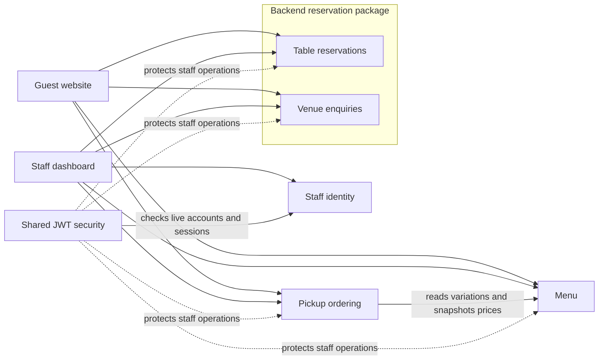

# Domain map

This map describes the implementation through Flyway **V16**, including menu
imports, JWT staff identity, pickup ordering, reservations, venue enquiries, payments
and tracking verification.
Folder names alone do not indicate implemented features; several domains remain
empty scaffolds.

## Application boundaries

The application has one React frontend, one Spring Boot backend and one PostgreSQL
database. Backend packages group business responsibilities within a single deployed
application. They are not separate services or independently enforced modules.

Backend source lives under `backend/src/main/java/au/com/nakornthai/`. Frontend
business features live under `frontend/src/domains/`, with public website pages in
`frontend/src/website/` and routing/providers in `frontend/src/app/`.

Arrows represent requests or dependencies, not asynchronous events. These features
use synchronous HTTP and database transactions; there is no message broker or
automatic order-status notification pipeline. Requested OTP delivery uses Twilio Verify.

## Implemented domains

| Domain | Responsibilities | Backend location | Frontend entry points |
|---|---|---|---|
| Identity | Staff accounts, roles, login, refresh, logout, session revocation and account administration | `identity/`; JWT enforcement in `shared/security/` | `domains/identity/`; login through protected staff pages; `/#/staff/users` |
| Menu | Categories, dishes, priced variations, collections, images and dietary/allergen data; public browsing and staff CRUD | `menu/` | `domains/menu/`; `website/components/SignatureDishes.jsx`; `domains/staff/pages/StaffMenuPage.jsx`; `/#/menu`, `/#/staff/menu` |
| Ordering | Guest pickup checkout, authoritative pricing, private tracking, FOH acceptance/handover and kitchen preparation | `ordering/` | `domains/ordering/` and operational pages in `domains/staff/`; `/#/checkout`, `/#/order-confirmation`, `/#/staff/foh`, `/#/staff/kitchen` |
| Table reservations | Guest table requests and staff confirmation, cancellation and attendance | `reservation/createreservation/`, `reservation/listreservations/`, `reservation/infrastructure/` | `domains/reservation/`; `/#/reservations`, `/#/staff/reservations` |
| Functions / venue enquiries | Event enquiries, preferred dates, contact details, staff follow-up and agreed event dates | `CreateFunctionEnquiry*`, `FunctionEnquiriesController` and persistence classes inside the existing `reservation/` folders | `website/pages/FunctionsPage.jsx`, `domains/reservation/api/functionApi.js`, `domains/staff/pages/FunctionEnquiriesPage.jsx`; `/#/functions`, `/#/staff/functions` |
| Payment | PayPal create/capture/reconciliation and staff-confirmed PayID receipt | `payment/` | `domains/payment/`, order receipt and FOH views |
| Tracking verification | Requested SMS/email codes and expiring tracking grants | `notification/` | `domains/ordering/pages/OrderTrackingPage.jsx`; `/#/track-order` |
| Staff workspace | Role-aware navigation and operational screens that call the owning feature APIs | No implemented logic in backend `staff/`; endpoints belong to identity/menu/ordering/reservation packages | `domains/staff/`; staff home at `/#/staff` |

The reservation package contains two distinct workflows and tables. A venue enquiry
does not create a table reservation automatically, and confirming either does not
create an order.

## Data ownership

All tables share the PostgreSQL `public` schema. Ownership below describes which
feature manages the data, not database-level isolation between modules. Flyway owns
schema changes; active persistence uses JPA entities and repositories/EntityManager.

| Owner | Tables | Migration history |
|---|---|---|
| Menu catalog | `menu_category`, `menu_item`, `menu_item_variation`, `menu_item_image`, `menu_collection`, `menu_collection_item` | V2 schema; V8 signature seed; V9 image focus; V10 Chef’s Specials; V14 printed menu |
| Menu dietary/allergen profiles | `dietary_tag`, `allergen`, `menu_item_dietary_tag`, `menu_item_allergen`, `menu_item_variation_dietary_tag`, `menu_item_variation_allergen` | V2 |
| Ordering | `restaurant_order`, `restaurant_order_item`, `restaurant_order_event` | V11 |
| Identity | `staff_user`, `staff_session` | V12 |
| Table reservations | `reservation` | V13 |
| Venue enquiries | `function_enquiry` | V15 |

V16 adds `order_payment`, `order_verification` and `order_tracking_grant`, plus order
email and payment-method support.

There are **22 application tables**, excluding Flyway's history table. V1 and
V3–V7 are retained empty migration placeholders; their names do not mean identity,
reservation, payment, customer or restaurant schemas were created by them.

## Dependencies and business rules

### Identity and staff access

Identity owns staff credentials and sessions. Shared security validates JWTs against
live session/account records, including current roles and enabled state. Access
JWTs stay in frontend memory; rotating refresh tokens use an HttpOnly cookie, with
only their hashes persisted. Staff writes retain CSRF protection.

| Capability | ADMIN | FOH | BOH |
|---|---|---|---|
| Staff account administration | Yes | No | No |
| Menu editing | Yes | No | No |
| FOH order queue, acceptance, cancellation and handover | Yes | Yes | No |
| Kitchen queue, preparation and ready status | Yes | No | Yes |
| Table reservation management | Yes | Yes | No |
| Functions / venue enquiry management | Yes | Yes | No |

The shared order-status endpoint permits all three staff roles at the security
boundary, then its handler checks permissions for the particular action. Frontend
route guards help navigation; backend checks enforce access.

Guests can browse menus and submit orders, reservations and venue enquiries without
staff accounts. Order tracking additionally requires the private tracking token;
public access at the security filter does not bypass that handler check.

### Menu to ordering

Ordering directly reads menu JPA entities and collection membership within its
transaction. It validates item/variation availability and the submitted expected
price, then snapshots dish name, variation name, quantity and unit price into order
lines. Later catalog changes do not rewrite an existing order's prices.

A dish can belong to many collections. Variations represent priced choices such as
protein or size; collections group offerings such as Chef’s Specials or Lunch
Specials. Menu dietary/allergen records are separate from these commercial groupings.
Printed labels do not automatically become verified food-suitability declarations.

Lunch imports are visible but unavailable for online ordering while daily service-hour
enforcement is absent. The restaurant-domain scaffold does not enforce opening hours.

Ordering supports pickup with pay-at-restaurant, configured PayPal and PayID.
Online-payment orders require verified receipt before acceptance/handover. PayPal
uses server-side capture and reconciliation; PayID is manually checked by staff.
Cancellation does not automatically refund a payment. Order status changes have their own event records with actors.

### Reservations and venue enquiries

Both accept guest contact details directly. Neither depends on a persisted customer
account or the unimplemented customer domain. They use client request UUIDs to
protect exact submission retries and version checks/row locks for staff updates.

Table requests progress from REQUESTED to staff confirmation, then attendance or
cancellation. Venue enquiries have a separate NEW/CONTACTED/CONFIRMED workflow and
require an agreed event date for confirmation. Staff manually check capacity and
contact guests. No automatic table allocation, exclusive venue hold, quote, deposit
or email/SMS confirmation is implemented.

Reservation and enquiry records retain the latest staff note, acting username and
update timestamp. Unlike order events, they do not keep an immutable history of
every transition. Actor usernames are recorded on business records; these workflows
do not create customer identities from guest names or contact details.

## Scaffolded domains and capabilities

| Scaffold | Current status | Boundary for future work |
|---|---|---|
| `customer/` | Backend and frontend files are empty | Customer profiles/accounts; linking guest transactions needs an explicit design |
| Payment webhooks/refunds and unused providers | Scaffolded | Current payment API supports PayPal capture and manual PayID reconciliation; automatic refunds/webhooks remain future work |
| Order/reservation status notifications | Scaffolded | Twilio Verify OTP delivery is implemented; automatic order-status emails/SMS remain future work |
| `restaurant/` | Backend and frontend files are empty | Opening hours, capacity and availability configuration |
| Backend `staff/` | Files are empty | Potential aggregate staff views; current endpoints remain in their owning domains |
| Reservation availability and cancellation slices | `checkavailability/` and `cancelreservation/` remain scaffolded | No dedicated availability engine or public cancellation endpoint; staff status changes use the implemented list controller |

Even active domains contain unused scaffold files. This map lists implemented
responsibilities without implying that every `domain/`, handler, hook or page is active.

## Shared technical responsibilities

- `shared/security/`: JWT signing/verification, authentication filter, password
  encoding and route authorization, backed by identity data.
- `shared/observability/`: request logging; application configuration provides
  metrics/tracing integration. Prometheus, Loki and Tempo are infrastructure
  integrations, not business domains.
- `frontend/src/app/`: hash routing and shared auth/cart providers.
- `infrastructure/`: deployment, Nginx, systemd and monitoring configuration.

Keep new code in the existing feature scaffold. Before introducing a new domain
folder, moving a responsibility or changing these boundaries, describe the proposed
structure change. Documentation of a future domain is not an implemented dependency.

## Feature references

- [Menu schema](../menu/menu-schema-v1.md) and [menu dashboard](../menu/menu-dashboard.md)
- [Staff identity](../identity/dashboard-identity.md)
- [Online ordering](../ordering/online-ordering.md)
- [Table reservations](../reservations/reservations.md)
- [Functions and venue enquiries](../functions/functions.md)
- [Backend deployment](../deployment/backend-deployment.md)
- [Project file inventory](protoype-file-inventory.md)

For the frontend-to-backend execution paths and linked source files, see
[workflow vertical slices](vertical-slices.md).

See [payments and tracking](../payment/payments-and-tracking.md) for provider setup.
