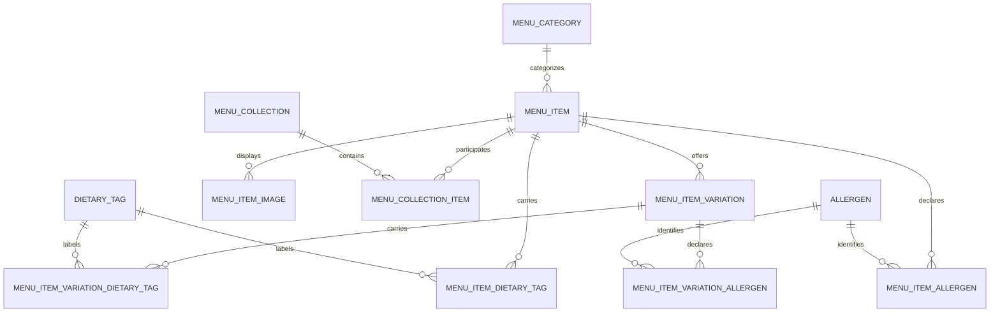

# Menu database schema — version 1

Status: schema and read-only Spring Boot collection API implemented locally.
Migrations have been verified against a disposable PostgreSQL database, not applied to the VPS.

## Scope

PostgreSQL, one restaurant, AUD prices, and restaurant timezone `Australia/Melbourne`.
The initial feature reads signature dishes from the database. The schema supports
categories, collections, variations, images, dietary badges, and allergen declarations.
Ordering, staff administration, and recipe management are not implemented by this design alone.

There are twelve tables. All remain within the existing menu domain and migration folder.
No folder restructuring is required. This document's version is independent of Flyway
migration numbering; the existing menu migration placeholder is `V2__create_menu_schema.sql`.

## Relationships



A dish has one primary food category and zero or more collection memberships.
Collections do not duplicate dishes or change their prices. Signature Dishes is a
collection with stable slug `signature-dishes`, not a flag on the dish.

## Shared conventions

- All columns are NOT NULL unless marked nullable below.
- Entity IDs use UUID primary keys generated by the backend. Association tables
  use the composite primary keys documented below.
- Every table includes `created_at TIMESTAMPTZ NOT NULL DEFAULT CURRENT_TIMESTAMP`,
  `updated_at TIMESTAMPTZ NOT NULL DEFAULT CURRENT_TIMESTAMP`, and
  `version BIGINT NOT NULL DEFAULT 0 CHECK (version >= 0)`.
- A shared database trigger sets `updated_at` on updates. Backend optimistic
  locking compares the expected version and increments it on successful updates.
  Operational SQL updates must also increment versions. Timestamps and versions
  are not a historical audit log.
- Names, descriptions where required, storage keys, and supplied optional codes
  must be nonblank after trimming. Optional text uses NULL rather than empty strings.
- Slugs are unique per table, lowercase, and match
  `^[a-z0-9]+(-[a-z0-9]+)*$`. Keep published slugs stable.
- Vocabulary codes match `^[A-Z][A-Z0-9_]*$` and are unique within their table.
- `display_order INTEGER NOT NULL DEFAULT 0 CHECK (display_order >= 0)` is shared
  wherever listed. Positions need not be unique; identifiers break ordering ties.
- Statuses use VARCHAR columns with CHECK constraints rather than database enums.
- Foreign keys reference primary keys. Hard deletion defaults to RESTRICT, with
  the collection-membership exception described below.
- Date entry/display uses the restaurant timezone; TIMESTAMPTZ stores instants,
  not the originating timezone name. Application configuration stores the timezone.

## 1. menu_category

Food classification, for example Curries, Stir-fries, or Desserts.

| Column | Type | Constraints / meaning |
|---|---|---|
| id | UUID | Primary key |
| name | VARCHAR(100) | Nonblank |
| slug | VARCHAR(120) | Unique, normalized slug |
| description | TEXT | Nullable |
| display_order | INTEGER | Shared ordering convention |
| is_active | BOOLEAN | Default true; public visibility |

Includes all shared tracking columns. Category deletion is restricted while dishes reference it.

## 2. menu_item

The canonical dish shared across categories, collections, and website cards.

| Column | Type | Constraints / meaning |
|---|---|---|
| id | UUID | Primary key |
| category_id | UUID | FK to menu_category.id |
| name | VARCHAR(150) | Nonblank |
| slug | VARCHAR(180) | Unique, normalized slug |
| description | TEXT | Nonblank |
| status | VARCHAR(20) | DRAFT, PUBLISHED, ARCHIVED; default DRAFT |
| is_available | BOOLEAN | Default true; temporary availability, independent of publication |
| display_order | INTEGER | Position within primary category |
| allergen_review_status | VARCHAR(20) | NOT_REVIEWED, REVIEWED, NEEDS_REVIEW; default NOT_REVIEWED |
| allergen_reviewed_at | TIMESTAMPTZ | Nullable; latest completed review |

Includes shared tracking columns. CHECK: REVIEWED requires a non-null
allergen_reviewed_at. NEEDS_REVIEW may retain the previous review timestamp.
There are no is_signature or signature_order columns.

Published unavailable dishes remain visible with an unavailable label. Public
responses exclude DRAFT/ARCHIVED dishes and dishes in inactive categories.
Archive retired dishes rather than deleting them.

## 3. menu_item_variation

A priced version, such as Standard, Small, Large, Chicken, or Prawn.

| Column | Type | Constraints / meaning |
|---|---|---|
| id | UUID | Primary key |
| menu_item_id | UUID | FK to menu_item.id |
| name | VARCHAR(100) | Nonblank, unique per dish ignoring case |
| sku | VARCHAR(80) | Nullable; unique when supplied; normalized uppercase by backend |
| price_minor | BIGINT | Nonnegative integer cents |
| currency | VARCHAR(3) | Default AUD; CHECK currency = 'AUD' in v1 |
| is_default | BOOLEAN | Default false |
| is_active | BOOLEAN | Default true |
| is_available | BOOLEAN | Default true |
| display_order | INTEGER | Position within dish |
| allergen_review_status | VARCHAR(20) | NOT_REVIEWED, REVIEWED, NEEDS_REVIEW; default NOT_REVIEWED |
| allergen_reviewed_at | TIMESTAMPTZ | Nullable; latest completed variation review |

Includes shared tracking columns. A partial unique index allows at most one
default variation per dish. CHECK: NOT is_default OR is_active.
CHECK: REVIEWED requires a non-null allergen_reviewed_at. NEEDS_REVIEW may
retain the previous review timestamp. Review state is independent for each variation.

For example, 2450 means AUD 24.50; never use floating point for money.
No item-level duplicate price is stored. A display-only dish may have zero
variations; do not invent prices for initial data. The backend maintains exactly
one default when active variations exist. That cross-row rule is transactional
application validation; the partial index alone guarantees only at most one.
Actual orderability and price/tax calculation are outside this display-only release.

## 4. menu_item_image

| Column | Type | Constraints / meaning |
|---|---|---|
| id | UUID | Primary key |
| menu_item_id | UUID | FK to menu_item.id |
| storage_key | TEXT | Stable media identifier/path; nonblank |
| alt_text | VARCHAR(255) | Nonblank accessible description |
| is_primary | BOOLEAN | Default false |
| display_order | INTEGER | Gallery ordering |

Includes shared tracking columns. UNIQUE(menu_item_id, storage_key). A partial
unique index permits at most one primary image per dish.

Store bytes in persistent media storage, not PostgreSQL. The backend resolves keys
to public URLs. Do not store expiring URLs, Vite hashes, or release-specific paths.
Deleting an image record does not itself delete the stored file. Use a frontend
placeholder if no primary image exists. Existing crop/scale/rotation behavior
remains presentation configuration initially.

## 5. menu_collection

Dynamic curated groups: Signature Dishes, Lunch Specials, Chef Specials,
Valentine's Day Specials, or Father's Day Specials. Names are data, not enums.

| Column | Type | Constraints / meaning |
|---|---|---|
| id | UUID | Primary key |
| name | VARCHAR(150) | Nonblank |
| slug | VARCHAR(180) | Unique, normalized slug |
| description | TEXT | Nullable introduction |
| status | VARCHAR(20) | DRAFT, PUBLISHED, ARCHIVED; default DRAFT |
| starts_at | TIMESTAMPTZ | Nullable inclusive visibility start |
| ends_at | TIMESTAMPTZ | Nullable exclusive visibility end |
| display_order | INTEGER | Collection listing order |

Includes shared tracking columns. CHECK: starts_at IS NULL OR ends_at IS NULL
OR ends_at > starts_at.

Public visibility:

```sql
status = 'PUBLISHED'
AND (starts_at IS NULL OR starts_at <= CURRENT_TIMESTAMP)
AND (ends_at IS NULL OR CURRENT_TIMESTAMP < ends_at)
```

Both dates NULL means indefinite visibility while published. Query evaluation
controls visibility; no activation job is required. If caching is introduced,
invalidate on edits and expire no later than the next schedule boundary.
Recurring weekday/service-hour windows and promotional price overrides are deferred.

## 6. menu_collection_item

| Column | Type | Constraints / meaning |
|---|---|---|
| collection_id | UUID | FK to menu_collection.id, ON DELETE CASCADE |
| menu_item_id | UUID | FK to menu_item.id, ON DELETE RESTRICT |
| display_order | INTEGER | Dish position within this collection |

Includes shared tracking columns. PRIMARY KEY(collection_id, menu_item_id).
Removing a membership never deletes its dish or other memberships. Prefer archive
for collections; explicitly deleting one removes only its membership rows.

Example: one Yellow Curry item can have separate memberships in Signature Dishes,
Lunch Specials, and Chef Specials, each with its own display order.

## 7. dietary_tag

Badge vocabulary. Initial candidate codes: VEGAN, VEGETARIAN, GLUTEN_FREE,
LACTOSE_FREE. Definitions and production claims require restaurant verification.

| Column | Type | Constraints / meaning |
|---|---|---|
| id | UUID | Primary key |
| code | VARCHAR(50) | Unique normalized code |
| name | VARCHAR(100) | Nonblank display label |
| description | TEXT | Nonblank definition of the badge |
| display_order | INTEGER | Badge ordering |
| is_active | BOOLEAN | Default true |

Includes shared tracking columns. Frontend maps codes to icons and falls back to
text for unknown codes. Never store executable markup for badges.

## 8. menu_item_dietary_tag

| Column | Type | Constraints / meaning |
|---|---|---|
| menu_item_id | UUID | FK to menu_item.id |
| dietary_tag_id | UUID | FK to dietary_tag.id |
| notes | TEXT | Nullable supporting explanation |
| verified_at | TIMESTAMPTZ | Nullable; NULL means not currently verified |

Includes shared tracking columns. PRIMARY KEY(menu_item_id, dietary_tag_id).
Only active vocabulary entries with non-null verified_at are eligible for public
badges. A recipe/supplier change clears affected verified_at values in the same
transaction as marking the item's allergen information NEEDS_REVIEW.

Badges describe the standard preparation shown. "Can be made vegan" is a future
preparation option, not an unconditional VEGAN assignment. Do not infer badges
from missing allergen rows. Lactose-free must not be interpreted as milk-free.

## 9. allergen

A controlled vocabulary, separate from dietary preferences. Candidate examples
include PEANUT, MILK, and SESAME; these are not an exhaustive regulatory list.
Confirm the production vocabulary against applicable Australian requirements
during implementation; this schema itself does not certify food-information compliance.

| Column | Type | Constraints / meaning |
|---|---|---|
| id | UUID | Primary key |
| code | VARCHAR(50) | Unique normalized code |
| name | VARCHAR(100) | Nonblank display name |
| description | TEXT | Nullable explanation |
| display_order | INTEGER | Display ordering |
| is_active | BOOLEAN | Default true |

Includes shared tracking columns. is_active controls selection for new assignments;
it must not silently hide existing public allergen declarations. Removing or
replacing referenced vocabulary requires explicit review of affected dishes.

## 10. menu_item_allergen

| Column | Type | Constraints / meaning |
|---|---|---|
| menu_item_id | UUID | FK to menu_item.id |
| allergen_id | UUID | FK to allergen.id |
| declaration | VARCHAR(20) | CHECK: CONTAINS or MAY_CONTAIN |
| notes | TEXT | Nullable ingredient or cross-contact explanation |
| verified_at | TIMESTAMPTZ | Nullable; when this declaration was last checked |

Includes shared tracking columns. PRIMARY KEY(menu_item_id, allergen_id).
For a given allergen, CONTAINS takes precedence if both ingredient presence and
cross-contact apply; retain relevant detail in notes rather than duplicate rows.

No row means unknown/undeclared, never allergen-free. A completed item review must
verify all its declarations in one transaction and set allergen_reviewed_at.
Previously recorded warnings remain visible with an explicit review-pending state
when information needs review; do not silently suppress warnings because they are stale.
Return review status to the frontend even when the declaration list is empty.

## 11. menu_item_variation_dietary_tag

Verified badges for one complete variation, including its base ingredients,
sauces, selected protein, and standard preparation.

| Column | Type | Constraints / meaning |
|---|---|---|
| variation_id | UUID | FK to menu_item_variation.id, ON DELETE RESTRICT |
| dietary_tag_id | UUID | FK to dietary_tag.id, ON DELETE RESTRICT |
| notes | TEXT | Nullable supporting explanation |
| verified_at | TIMESTAMPTZ | Nullable; NULL means not currently verified |

Includes shared tracking columns. PRIMARY KEY(variation_id, dietary_tag_id).
Only active vocabulary entries with non-null verified_at qualify as public badges.
These are complete variation declarations, not additions to item-level badges.
No row means no verified claim, not a negative assertion about the diet.

## 12. menu_item_variation_allergen

Allergen declarations for the complete prepared variation, not just its protein.

| Column | Type | Constraints / meaning |
|---|---|---|
| variation_id | UUID | FK to menu_item_variation.id, ON DELETE RESTRICT |
| allergen_id | UUID | FK to allergen.id, ON DELETE RESTRICT |
| declaration | VARCHAR(20) | CHECK: CONTAINS or MAY_CONTAIN |
| notes | TEXT | Nullable ingredient or cross-contact explanation |
| verified_at | TIMESTAMPTZ | Nullable; when this declaration was last checked |

Includes shared tracking columns. PRIMARY KEY(variation_id, allergen_id).
CONTAINS takes precedence over MAY_CONTAIN for the same allergen. Missing rows
never mean allergen-free. Existing warnings remain visible even if their vocabulary
entry is inactive or review becomes stale, with the review state made explicit.
Completing a review verifies all variation declarations and updates the variation's
review status and timestamp in one transaction.

## Variation declaration and display rules

Use complete, independently reviewed profiles rather than inheritance or overrides:

| Display context | Source of dietary/allergen information |
|---|---|
| Dish without active variations | Item-level declarations for its standard preparation |
| Explicitly selected active variation | That variation's declarations and review state only |
| Generic dish card with active variations | Show “Dietary and allergen information varies by option”; provide access to the options |
| Card explicitly showing a default variation | Default variation's declarations, with its variation name clearly displayed |

Never copy, merge, or fall back to item-level declarations at read time for a
selected variation. An unreviewed variation stays explicitly unreviewed even if
its parent or default variation is reviewed. Shared ingredients must appear in
every applicable variation profile; this intentional duplication makes the scope
of each claim explicit. A future recipe model may help maintain these profiles.
A missing or inactive selected variation is rejected rather than silently replaced
with the default. Validate that any selected variation belongs to the requested dish.

Item-level profiles may remain stored when variations are introduced, but they
are not public substitutes for variation profiles. If the last active variation
is deactivated, require review of the item-level profile before reusing its badges;
mark its allergen state NEEDS_REVIEW and clear dietary verification as appropriate.

Example: one Fried Rice item has four predefined, independently priced variations:

| Variation | Dietary/allergen profile |
|---|---|
| Pork | Staff review of the complete Pork Fried Rice preparation |
| Seafood | Staff review of the complete Seafood Fried Rice preparation |
| Pork & Seafood | Staff review of the complete combined preparation |
| Beef | Staff review of the complete Beef Fried Rice preparation |

These names are examples, not ingredient or suitability declarations. In particular,
“Seafood” is a variation label, not a substitute for specific allergen declarations.
Do not derive badges or allergens from names or automatically combine the Pork and
Seafood profiles to declare the combined preparation reviewed.

Review invalidation rules enforced transactionally by backend update operations:

- A variation-specific ingredient, supplier, or preparation change marks that
  variation NEEDS_REVIEW and clears its dietary-tag verified_at values.
- A shared recipe, sauce, supplier, or preparation change marks the item and all
  affected variations NEEDS_REVIEW and clears affected dietary verification.
  Include inactive variations so reactivation cannot resurrect stale claims.
- Keep prior allergen declarations visible with review-pending status; retained
  verified_at values describe the last check, not current approval.
- Adding or changing an allergen declaration invalidates the corresponding completed
  review unless the same authorized operation performs and records a full review.
- New variations start NOT_REVIEWED, without automatically verified badges.
- Record the reviewed declarations, status, timestamps, and version changes in
  one transaction. Database foreign keys alone cannot enforce recipe-review logic.

For public API responses, scope information explicitly using item-level data for
unvaried dishes and nested profiles on each active variation for varied dishes.
Each profile includes dietary tags, allergen declarations, allergen review status,
and review timestamp. A varied item's top-level profile is null with an explicit
VARIATION_REQUIRED scope indicator; never use an empty list to imply suitability.
When an option is selected, the frontend displays that named option's profile.

## Indexes

Primary keys and uniqueness constraints create their own indexes. Add:

| Table | Index / purpose |
|---|---|
| menu_item | (category_id, status, display_order, id) |
| menu_item_variation | (menu_item_id, display_order, id) |
| menu_item_variation | UNIQUE(menu_item_id, lower(name)) |
| menu_item_variation | UNIQUE(menu_item_id) WHERE is_default |
| menu_item_image | (menu_item_id, display_order, id) |
| menu_item_image | UNIQUE(menu_item_id) WHERE is_primary |
| menu_collection | (status, display_order, id) |
| menu_collection_item | (collection_id, display_order, menu_item_id) |
| menu_collection_item | (menu_item_id) for reverse membership lookups |
| menu_item_dietary_tag | (dietary_tag_id) for reverse lookups |
| menu_item_allergen | (allergen_id) for reverse lookups |
| menu_item_variation_dietary_tag | (dietary_tag_id) for reverse lookups |
| menu_item_variation_allergen | (allergen_id) for reverse lookups |

Association primary keys already support lookups by their first column.

## Initial data and public query

Seed the Curries and Stir-fries categories, the four existing homepage dishes,
their image references, the published signature-dishes collection, and its four
ordered memberships. Confirm stable media storage before seeding image keys.
Seed only reviewed vocabulary definitions; do not assign unverified dietary or
allergen claims to dishes or variations. Initial dishes use NOT_REVIEWED and no invented prices.

Proposed endpoint:

```http
GET /api/menu/collections/signature-dishes/items
```

Query rules:

1. Require a published collection inside its visibility interval.
2. Include only PUBLISHED items whose primary category is active.
3. Order by membership display_order, then menu_item_id.
4. Return temporary availability, primary image, verified dietary badges,
   allergen declarations, and allergen review status according to the variation
   display rules above. Active variations carry their own scoped profiles.
5. A visible collection may return an empty items array. Unknown or nonpublic
   collection slugs return 404 from the public endpoint.
6. Return price only from an active variation when requested; never fabricate zero
   to represent an unknown price. This initial homepage does not require prices.

Frontend must handle loading, empty results, failed requests, missing images, and
unreviewed food information. Empty badge/allergen arrays must not be rendered as
"no allergens" or as a dietary-suitability claim.

## Deferred features and implementation boundaries

- Predefined variation dietary/allergen declarations are included in v1. Free-form
  combinations and modifier contributions remain deferred; they require explicit
  composition and review rules before supporting configurable orders.
- Recurring lunch/service windows, collection prices, modifiers, ingredient
  recipes, inventory, tax rules, locations, and full staff audit history are deferred.
- Future order lines must snapshot purchased names, options, and prices.
- Staff identity/reviewer references can be added when the identity module exists.
  v1 timestamps do not record who verified a declaration.
- Administrative updates require authenticated authorization when implemented;
  the initial public endpoint is read-only.
- Persistence and API code belong in existing menu/domain, menu/listmenu, and
  menu/infrastructure folders. Frontend fetching belongs in domains/menu;
  website/components/SignatureDishes.jsx remains the presentation component.
- Database schema changes use versioned files in the existing migration folder.
  Confirm migration history before populating or adding migrations; do not rewrite
  an applied migration merely because its local counterpart is currently empty.

## Design background

The catalogue/variation and menu-group concepts follow patterns documented by
[Square](https://developer.squareup.com/docs/catalog-api/what-it-does) and
[Toast](https://doc.toasttab.com/doc/devguide/menu_information_config_api.html).
The collection and review-state rules above are application design decisions for
Nakorn Thai, not claims that those providers prescribe this exact SQL schema.

## Implementation status

The backend uses Java 21, Spring Boot 4.1.1, JPA entities and Spring Data repositories, and Flyway.
V2 creates these twelve tables; V8 seeds the existing four dishes and signature
collection. Image records, actual prices, and dietary/allergen vocabulary/assignments
are deferred until media provisioning and restaurant verification. Image responses
are null until records are added. No identity or authenticated write handlers are
implemented; transactional review invalidation and version checks remain requirements
for future writes, not behavior supplied by the read-only API.

See [backend setup and testing](../backend/README.md). No existing folder was moved
or reorganized. The deployed frontend still uses its static content until its API
integration and VPS backend service are implemented.

### JPA mapping implementation

All twelve tables are mapped with @Entity in the existing menu/infrastructure
folder. Shared mapped superclasses provide generated UUIDs, @Version, and
trigger-backed timestamps. Composite memberships use @EmbeddedId/@MapsId, and
all tables have typed Spring Data repositories. The collection read uses JPQL
and MenuItemMapper; native PostgreSQL JSON projections have been removed.
Hibernate validates mappings against the Flyway-created schema on startup.
Public API records remain separate from persistence entities. Internal entity
saves and optimistic locking are implemented; public administrative write flows
and recipe-review invalidation rules remain future work.
