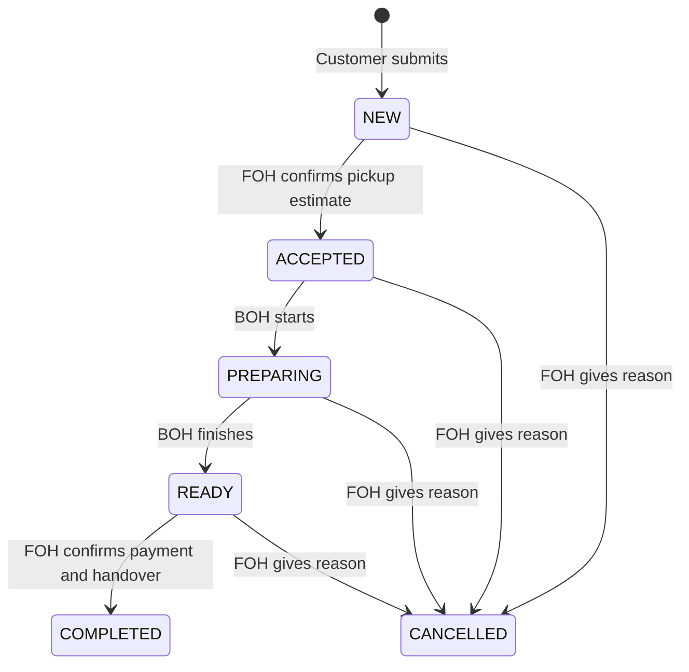

# Pickup ordering and restaurant staff dashboards

This first release supports **pickup with payment at the restaurant**. Customers
add Chef's Special Recommendations variations to a cart, provide a name, phone
number and optional notes, and submit for restaurant confirmation. No card details
are collected and no payment gateway, delivery, scheduled pickup, refunds, receipt
printing, email or SMS integrations are implemented.

## Customer flow

- `/#/menu`: browse the Chef's collection, select variations and quantities, and
  review the cart. The homepage **Order online** link opens this page.
- `/#/checkout`: see current prices, provide contact details and place a pickup
  order. Prices and availability are rechecked before submission and again on the
  server. No order is automatically promised a preparation time.
- `/#/order-confirmation`: private order tracking refreshes every five seconds.
  The customer waits for FOH confirmation and then sees the estimated pickup time,
  preparation, ready, collection or cancellation status.

The cart is retained in this browser tab's session storage. A pending submission
stores its exact request (including contact details and notes) there until receipt
is confirmed; retries and reloads reuse its UUID request key. Once confirmed, those
pending details are removed, and only the order ID and a random tracking secret
remain in session storage. The secret is sent in `X-Order-Token`, never in the URL.
A different browser/tab without that receipt cannot recover private tracking.
FOH can use the customer's phone number to contact them manually.

A cart supports up to 30 distinct variations and 20 of each. Prices are AUD cents
on the server; the submitted expected price only detects changes, never sets the
charged amount. Names and prices are snapshotted into order lines. Later menu edits
cannot alter an existing order. A successful retry returns the original order even
if its menu price or availability has since changed. Reusing a request key with
different details returns a conflict. Completed/cancelled orders remain persisted.

## Staff flow

Open `/#/staff` for staff navigation. All dashboards share a JWT login backed by persistent staff accounts.
See [dashboard identity](dashboard-identity.md) for setup and account management. The existing admin account can use
all three dashboards; FOH and BOH accounts have narrower permissions.

| Page | Account roles | Work |
|---|---|---|
| `/#/staff/foh` | FOH or ADMIN | See customer contact details; accept, cancel and hand over orders |
| `/#/staff/kitchen` | BOH or ADMIN | See accepted tickets and customer notes; start preparation and mark ready |
| `/#/staff/menu` | ADMIN | Manage menu content, prices and images |

Kitchen responses omit the customer's name and phone number. Both queues refresh
every five seconds; stale or failed queues disable action buttons until refreshed.
Polling and mutation requests are serialized to prevent CSRF-token rotation during
a status update. Access tokens remain in React memory; rotating refresh tokens use an HttpOnly cookie.



FOH must enter a pickup estimate of 5–180 minutes when accepting. Completion requires
explicit confirmation that payment was collected and the order handed over. This
records a staff acknowledgement; it does not charge a card. Cancellation requires
a reason shown to the customer. Invalid transitions and stale order versions are
rejected. Every successful transition records the acting staff username and time.

Active queues show up to 200 orders, oldest first. FOH also has a completed/cancelled
view for orders created in the preceding 24 hours. This is a work queue, not an
accounting report or permanent history browser. Create individual staff accounts at `/#/staff/users` so the audit trail identifies
the employee who performed each action.

## Enable in local development

Use your local PostgreSQL database and the ignored **`backend/.env.dev`** file.
Do not put staff credentials or the ordering flag in frontend environment files.
Spring Boot does not automatically load `.env.dev`; load it into the process
environment before starting the backend.

1. If you do not already have `backend/.env.dev`, create it from
   `backend/.env.dev.example`. Preserve an existing file and its database credentials.
   Set `DB_URL`, `DB_USERNAME` and `DB_PASSWORD` for your local database as described
   in [backend/README.md](../backend/README.md).
2. Generate local staff password hashes (if `htpasswd` is unavailable on Ubuntu,
   install `apache2-utils`):

   ```bash
   htpasswd -nBC 12 foh
   htpasswd -nBC 12 kitchen
   ```

   Each command prompts for a password and prints `username:bcrypt-hash`. Copy
   only the hash after the colon. Use the original password when signing in.
3. Add or update these entries in `backend/.env.dev`, replacing both placeholders
   with the generated hashes. Keep single quotes around the hashes:

   ```dotenv
   SPRING_PROFILES_ACTIVE=dev
   ONLINE_ORDERING_ENABLED=true
   FOH_USERNAME=foh
   FOH_PASSWORD_HASH='REPLACE_WITH_FOH_BCRYPT_HASH'
   BOH_USERNAME=kitchen
   BOH_PASSWORD_HASH='REPLACE_WITH_KITCHEN_BCRYPT_HASH'
   ```

   Keep usernames distinct from `MENU_ADMIN_USERNAME`. If you already configured
   the menu admin account, you can use it for both operational dashboards during
   local testing and leave the FOH/BOH hashes empty. Separate accounts let you test
   the role restrictions.
4. Stop any running local backend with Ctrl+C, then start it from the repository
   root in a terminal using Java 21:

   ```bash
   cd backend
   set -a
   source .env.dev
   set +a
   mvn spring-boot:run
   ```

   Flyway applies any pending migrations, including V10's Chef's collection and
   V11's order tables. An env-file edit takes effect only after reloading the file
   and restarting the backend. For an IntelliJ run configuration, supply the same
   variables in its environment settings; selecting the `dev` profile alone does
   not load `.env.dev`.
5. In a second terminal, from the repository root:

   ```bash
   cd frontend
   npm ci --include=optional
   npm run dev
   ```

   Vite proxies `/api/` to `127.0.0.1:8080`; local Nginx and SSL are not required
   when using localhost. If Vite selects a different port, use the URL it prints.
6. Verify the backend and Vite proxy:

   ```bash
   curl -fsS http://127.0.0.1:8080/api/orders/options
   curl -fsS http://localhost:5173/api/orders/options
   ```

   Both should contain `"enabled":true`, `"fulfilment":"PICKUP"` and
   `"payment":"PAY_AT_RESTAURANT"` (JSON field order may differ). If enabled is
   false, check that the running backend inherited the flag; if a connection is
   refused, check backend startup logs and port availability.

Open these pages in separate tabs:

| Local page | Purpose |
|---|---|
| `http://localhost:5173/#/menu` | Add dishes and begin customer checkout |
| `http://localhost:5173/#/staff/foh` | Sign in as FOH and accept the test order |
| `http://localhost:5173/#/staff/kitchen` | Sign in as kitchen and prepare the order |
| `http://localhost:5173/#/staff/menu` | Sign in as admin to manage dishes |

For a complete test, submit a pickup order, accept it in FOH with a pickup estimate,
mark it preparing and ready in the kitchen, then confirm payment and handover in
FOH. Keep the customer's confirmation tab open to see status changes. Refresh the
menu page after changing the ordering flag, because it reads availability on load.

To disable local ordering, set `ONLINE_ORDERING_ENABLED=false` in `.env.dev`, reload
that file and restart the backend. This does not change the VPS environment.

## Enable on the VPS

V11 creates `restaurant_order`, `restaurant_order_item`, and
`restaurant_order_event`. Existing migrations, including the empty V4 placeholder,
remain unchanged. Deploy the updated backend and frontend through the workflow.

Online ordering defaults to **closed** until staff accounts and the operating
process are ready. Generate separate bcrypt hashes interactively:

```bash
htpasswd -nBC 12 foh
htpasswd -nBC 12 kitchen
sudoedit /etc/nakorn-thai/backend.env
```

Copy only each hash after the username prefix. Add these variables to the private
backend environment file, using single quotes around hashes to preserve `$`:

```dotenv
FOH_USERNAME=foh
FOH_PASSWORD_HASH='REPLACE_WITH_FOH_BCRYPT_HASH'
BOH_USERNAME=kitchen
BOH_PASSWORD_HASH='REPLACE_WITH_KITCHEN_BCRYPT_HASH'
ONLINE_ORDERING_ENABLED=true
```

Use distinct usernames for ADMIN, FOH and BOH. Empty hashes skip bootstrap creation; existing database accounts remain active.
Disable accounts in the identity dashboard. Production also requires
`JWT_SECRET_BASE64`; see [identity setup](dashboard-identity.md). The existing
`/api/` Nginx proxy covers the new endpoints. Keep the backend listeners private and
use HTTPS for customer checkout and staff authentication.

```bash
sudo systemctl restart nakorn-thai-backend.service
curl -fsS http://127.0.0.1:8080/api/orders/options
curl -fsS https://nakorn-thai.tech-labs.dev/api/orders/options
```

Both should report `enabled: true`, `PICKUP`, and `PAY_AT_RESTAURANT`. Have FOH and
kitchen dashboards open before accepting live orders. To close new submissions,
set `ONLINE_ORDERING_ENABLED=false` and restart the backend. Existing orders remain
trackable and actionable. This release does not infer restaurant opening hours or
automatically close ordering when staff disconnect.

The pickup address displayed in checkout is the existing website address:
233 Glenferrie Rd, Malvern VIC 3144. Confirm this is correct before enabling orders.

## APIs and validation

| Method | Path | Access |
|---|---|---|
| GET | `/api/orders/options` | Public ordering availability |
| GET | `/api/orders/csrf` | Public CSRF token; session cookie required on submission |
| POST | `/api/orders` | Public with CSRF; validated guest pickup request |
| GET | `/api/orders/{id}` | Matching private `X-Order-Token` header |
| GET | `/api/staff/foh/orders?history=false` | FOH/ADMIN |
| GET | `/api/staff/kitchen/orders` | BOH/ADMIN |
| GET | `/api/staff/orders/csrf` | Any configured staff role |
| PATCH | `/api/staff/orders/{id}/status` | Staff, CSRF and transition-specific role |

The creation request includes `requestId`, a 64-character random hexadecimal
`trackingToken`, `customerName`, `phone`, `notes`, and lines containing `variationId`,
`quantity`, and `expectedUnitPriceMinor`. Public tracking responses omit contact
name and phone. Validation errors avoid logging submitted contact details/tokens.
Tracking/order responses are not cached. Order timestamps use UTC in storage and
are displayed in the browser's local time.

No source directories were restructured: implementation uses the existing ordering
and staff scaffold. `mvn verify` runs the PostgreSQL lifecycle tests when
`DB_TEST_URL` is configured for a disposable database. `npm test` covers cart cents,
quantity limits, idempotent request payloads, private tracking headers, and staff
poll/write serialization. `npm run build` builds the production frontend.
